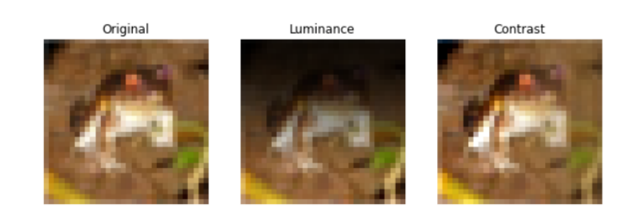
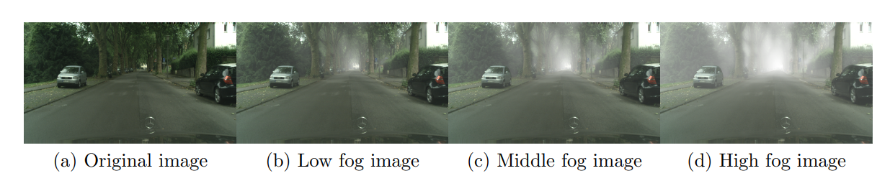

# Autonomous driving semantic segmentation improvement using divisive normalization

One of the key problems in computer vision is adaptation: models are too rigid to follow the variability of the inputs. The canonical computation that explains adaptation in sensory neuroscience is divisive normalization, and it has appealing effects on image manifolds. In this work we show that including divisive normalization in current deep networks makes them more invariant to non-informative changes in the images. In particular, the main objective is to check if the segmentation of autonomous driving images is improved by applying the divisive normalization (DN), specially for bad weather condition, such as fog, which introduces variability in textures. However, we face two problems:

## Classification problem

### Dataset

We use the [Cifar-10 Dataset](https://www.cs.toronto.edu/~kriz/cifar.html) in this problem. It consits of 60000 32 x 32 colour images in 10 classes. It is divided into 50000 training images and 10000 test images. We extract 5000 random images from the training images to use them as validation images. As the Cifar-10 images are so perfect, we perform two random modifications which locally change the contrast or the luminance of the images.

    

### Experiments and results

We build and train three different models. The first one, without any DN layers, has three convolutional layers with RELU followed by an average pooling and a final 10 neurons layers with soft-max activation function to predict the class of each image. The second model has the same extructure but includes one DN layer located in the first position, i.e. the first layer of the model is the DN layer. Finally, the last model has the same extructure too but it includes three DN layers located before each convolutional layer.

We train each model 2000 epochs with the modified dataset. We repeat 10 times with different seeds and then we evaluate the models with the modified and the original data. Next table shows the mean and standard deviation accuracy performance in test and the improvements of the use of DN layers with regard no using DN in parenthesis.

| Dataset           |   No DN layers   |        1 DN layer       |      3 DN layers        |
|:-----------------:|:----------------:|:-----------------------:|:-----------------------:|
| Original Cifar-10 |  0.75 &pm; 0.01  |  0.76 &pm; 0.01 (1.3%)  |  0.77 &pm; 0.01 (2.7%)  |
| Modified Cifar-10 |  0.74 &pm; 0.01  |  0.75 &pm; 0.01 (1.4%)  |  0.77 &pm; 0.01 (4.1%)  |

### Results

The use of one or three DN layers gives an increase in accuracy in the two datasets. Also, as expected with the modified dataset we get smaller accuracy because the images have more variability. It happens in the No-DN and the 1-DN models but not for the 3-DN models, which shows that with 3-DN layers the models are able to adapt themselves to theses changes and not preform a reduction in the accuracy. Also it is important to highlight that the increase in accuracy when comparing the No-DN models with regard the 3-DN models is higher for the modified dataset.

## Segmentation problem

### Dataset

We use the Cityscapes dataset in this problem. It is a large-scale dataset that contains a diverse set of stereo video sequences recorded in street scenes from 50 different cities, with high quality pixel-level annotations of 5000 frames in addition to a larger set of 20000 weakly annotated frames. You can access it from [here](https://www.cityscapes-dataset.com/).

    

Also we use the Foggy Cityscapes, which is a modification of the original Cityscapes to simulate different fog levels, to test the models. You can access it from [here](http://people.ee.ethz.ch/~csakarid/SFSU_synthetic/).

    

### Experiments and results

We build and train three different models, all of them following the [U-Net architecture](https://lmb.informatik.uni-freiburg.de/people/ronneber/u-net/). The first one, without any DN layers, simply replicates the U-Net architecture for our segmentation problem. The second model has the same extructure but includes one DN layer located in the first position, i.e. the first layer of the model is the DN layer. Finally, the last model has the same extructure too but it includes four DN layers located before each convolutional block of the encoder path.

We train each model 500 epochs with the original Cityscapes dataset. We repeat 10 times with different seeds and then we evaluate the models with the original dataset and also with the different fog levels test images from the Foggy Cityscapes. Next table shows the mean and standard deviation IoU performance in test for each dataset and the improvements of the use of DN layers with regard no using DN in parenthesis.

| Dataset               |   No DN layers   |        1 DN layer        |      4 DN layers         |
|:---------------------:|:----------------:|:------------------------:|:------------------------:|
| Original Cityscapes   |  0.75 &pm; 0.02  |  0.75 &pm; 0.01 (0.0%)   |  0.77 &pm; 0.02 (2.7%)   |
| Low fog Cityscapes    |  0.65 &pm; 0.02  |  0.65 &pm; 0.04 (0.0%)   |  0.70 &pm; 0.02 (7.7%)   |
| Middle fog Cityscapes |  0.54 &pm; 0.03  |  0.53 &pm; 0.04 (-1.9%)  |  0.62 &pm; 0.03 (14.8%)  |
| High fog Cityscapes   |  0.40 &pm; 0.05  |  0.38 &pm; 0.04 (-5.0%)  |  0.48 &pm; 0.03 (20.0%)  |

Next table shows the reductions in mean test IoU when comparing each fog level with the original, i.e. comparing the results of each model in the different datasets.

| Dataset change        | No DN layers |  1 DN layer | 4 DN layers |
|:---------------------:|:------------:|:-----------:|:-----------:|
| Original - Low fog    |    -13.3%    |   -13.3%    |    -9.1%    |
| Original - Middle fog |    -28.0%    |   -29.3%    |    -19.5%   |
| Original - High fog   |    -46.7%    |   -49.3%)   |    -37.7%   |

### Results

Although using just 1-GDN seems not to have a really important effect, using 4-GDN layers gives substantial increase in IoU in all cases. As expected, for  rogressively heavier fog, IoU gets reduced in all cases. However the conventional architecture is more sensitive to the decrease in visibility (bigger reductions in performance) than the architecture with 4-GDN layers. The use of 4-GDN always leads to improvements with regard the No-GDN case, but it is important to see that the gains get progressively bigger when the acquisition conditions are poor.

## Cite

@misc{hernandez_divisive_normalization_segmentation,  
  author = {Hernández-Cámara, Pablo and Laparra, Valero and Malo, Jesús},  
  title = {Neural Networks with Divisive normalization for image segmentation with application in cityscapes dataset},   
  doi = {10.48550/ARXIV.2203.13558},    
  url = {https://arxiv.org/abs/2203.13558},    
  publisher = {arXiv},    
  year = {2022}}

